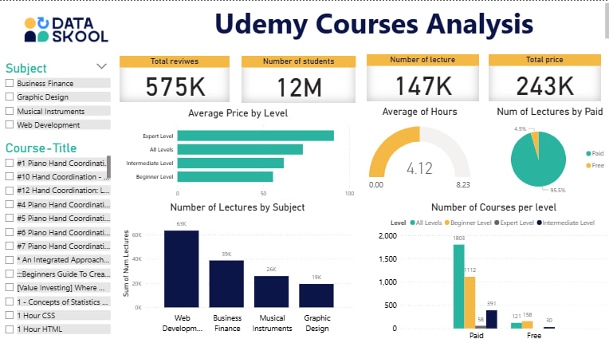

# 📊 Udemy Courses Analysis – Power BI Dashboard

## 🔹 Project Overview

This project analyzes Udemy course data and visualizes it through an **interactive Power BI dashboard**.
The goal is to uncover insights about students, reviews, pricing, levels, and content distribution across different categories.

## 🔹 Dataset

The dataset includes information about:

* Course title, subject, and level
* Number of lectures & hours
* Students enrolled
* Reviews
* Price (Free / Paid)

## 🔹 Key Insights

📌 **Total Students:** 12M+
📌 **Total Reviews:** 575K
📌 **Number of Lectures:** 147K
📌 **Average Hours per Course:** 4.12

### Findings

* **95.5% of courses are Paid** vs **4.5% Free**
* **Web Development** has the highest number of lectures (**63K**)
* **Expert Level courses** are the most expensive

## 🔹 Dashboard Preview


The dashboard includes:

* Course distribution by **Level & Pricing**
* Total **Students & Reviews**
* **Category-wise lectures & hours**
* Interactive filters for deeper exploration

## 🔹 Tools & Technologies

* **Power BI** (Data cleaning, transformation, visualization)
* **Excel/CSV** dataset

## 🔹 How to Use

1. Clone the repository

   ```bash
   git clone https://github.com/your-username/udemy-powerbi-analysis.git
   ```
2. Open the `.pbix` file in Power BI Desktop
3. Explore the dashboard and apply filters

